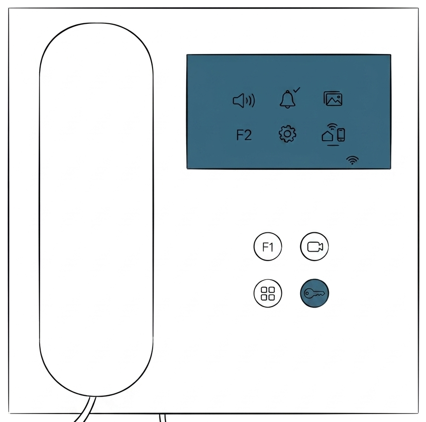
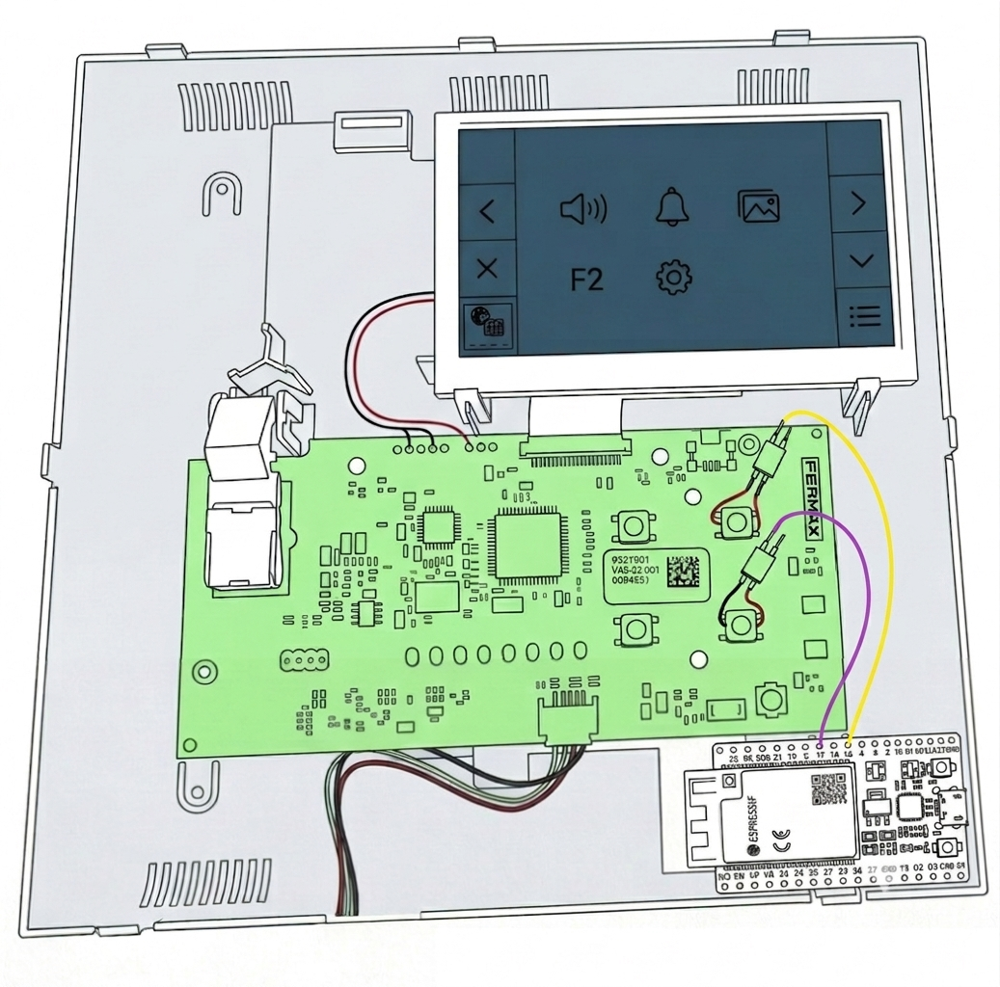
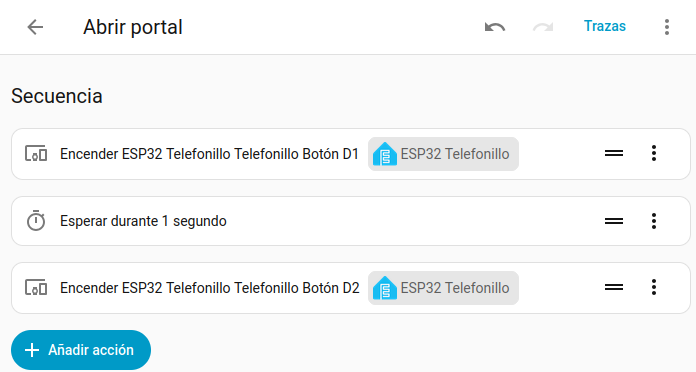
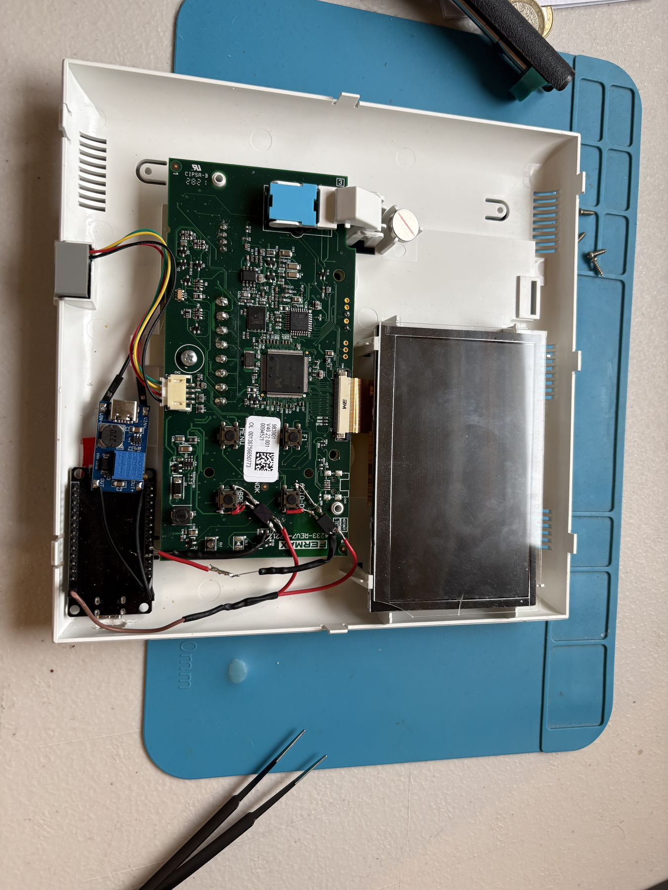
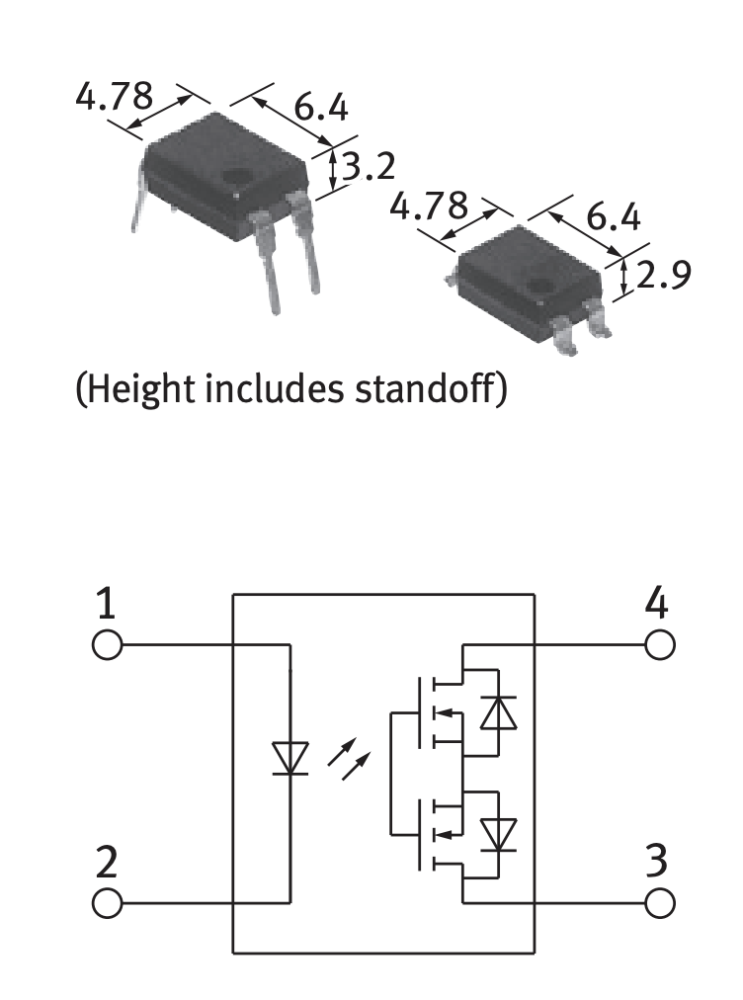

# Fermax 9445 — apertura remota con ESP32 + ESPHome

Control remoto del botón de apertura del telefonillo Fermax 9445 desde Home Assistant, usando un ESP32 alimentado por la propia placa del telefonillo.

| :exclamation: **Alcance del proyecto** :exclamation:|
|----------------------------------------------|
| Sólo permite la apertura remota. No hay detección de llamada, no hay audio ni vídeo.|

---

## Cómo funciona

 

El Fermax 9445 tiene botones físicos en la placa: uno de ellos sirve para activar la **cámara** y el otro con la **llave** sirve para abrir la puerta.
La idea es simple: soldar un relé de estado sólido AQY210 en paralelo a cada botón, de modo que el ESP32 pueda cerrar ese circuito por software, simulando exactamente una pulsación física.

De esta manera, podremos simular las pulsacines de ambos botones y realizar la apertura de la puerta en remoto siguiendo el siguiente flujo:
1. Simular pulsar el botón **cámara** (activa el telefonillo)
2. Esperar 1 segundo
3. Simular pulsar el botón **llave** (abre la puerta)

---

## Hardware

- ESP32 (cualquier variante)
- 2× relé de estado sólido [AQY210](https://es.aliexpress.com/item/1005009058582391.html?spm=a2g0o.productlist.main.2.642253b088SiRU&aem_p4p_detail=202511130344231234185261474500000038759&algo_pvid=35455d73-76f4-4f5b-87aa-74443dad6541&pdp_ext_f=%7B%22order%22%3A%224%22%2C%22eval%22%3A%221%22%2C%22fromPage%22%3A%22search%22%7D&utparam-url=scene%3Asearch%7Cquery_from%3A%7Cx_object_id%3A1005009058582391%7C_p_origin_prod%3A&search_p4p_id=202511130344231234185261474500000038759_1)
- Alimentación tomada de la propia placa del Fermax (ver más abajo)

### Pines utilizados

| Pin ESP32 | Función |
|---|---|
| GPIO 26 | Simula botón cámara |
| GPIO 27 | Simula botón llave (apertura) |

### Conexión de los AQY210

Cada relé va soldado en paralelo al botón correspondiente de la placa del Fermax:

```
GPIO ESP32 → LED+ del AQY210
GND ESP32  → LED- del AQY210

Colector AQY210 → pad 1 del botón Fermax
Emisor   AQY210 → pad 2 del botón Fermax
```

Cuando el ESP32 pone el pin en HIGH, el LED del relé conduce y el fototransistor cierra el circuito del botón — exactamente como si lo pulsaras a mano.

### Alimentación del ESP32

El ESP32 se alimenta directamente desde la placa del Fermax.
En la parte superior de la parte trasera de la placa (donde no están los pulsadores de los botones) existe un punto de alimentación de 5V. -*No se dispone de fotografía*-

Otra opción igualmente válida es alimentar el ESP32 por cable.

---

## Firmware (ESPHome)

El ESP32 corre ESPHome. La configuración es mínima: dos `output` que activan los pines durante un breve pulso de 300ms y los vuelve a desactivar. Este breve paso de corriente es suficiente para simular la pulsación fisica del boton por software.

```yaml
# Fragmento esphome

switch:
  # ---------- BOTÓN DERECHA ARRIBA ----------
  - platform: gpio
    name: "Telefonillo Botón D1"
    pin: GPIO26
    id: boton_d1
    restore_mode: ALWAYS_OFF
    on_turn_on:
      - delay: 300ms
      - switch.turn_off: boton_d1

  # ---------- BOTÓN DERECHA ABAJO ----------
  - platform: gpio
    name: "Telefonillo Botón D2"
    pin: GPIO27
    id: boton_d2
    restore_mode: ALWAYS_OFF
    on_turn_on:
      - delay: 300ms
      - switch.turn_off: boton_d2
```

> El archivo completo está en `firmware/fermax.yaml`.

---

## Uso en Home Assistant

El script que abre la puerta cuando se dispara manualmente. Simplemente acciona el botón de la cámara, espera durante 1 segundo y acciona el botón de la llave.



---

## Limitaciones del proyecto

- **No hay detección de llamada** — no sabemos cuándo llaman, hay que abrir manualmente desde HA.
- **No hay audio ni vídeo** — el protocolo del Fermax 9445 no lo expone de forma accesible.
- **Apertura a ciegas** — es tu responsabilidad decidir cuándo abrir.

---

## Fotos

### Interior del portero



### AQY210



---

## Licencia

MIT
